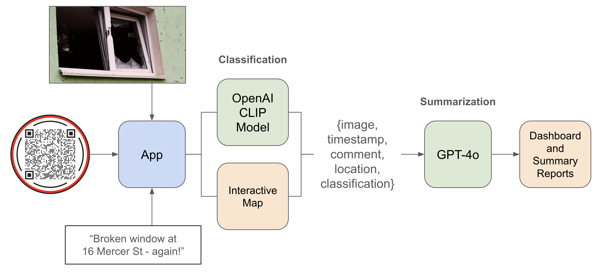

# Broken Window Hackathon #1
### Hosted by FutureLondon.org:
"Future London is a community of high-agency techno-optimists. We believe that the UK is broken. But it doesn't have to be."

---

## "I Love My Neighbourhood" - How AI Can Empower a Community

Created by:  
[@mhodierne1402](https://github.com/mhodierne1402)  
[@kailash19961996](https://github.com/kailash19961996)

### Background

> In criminology, the broken windows theory states that visible signs of crime, antisocial behavior, and civil disorder create an urban environment that encourages further crime and disorder, including serious crimes. The theory suggests that policing methods that target minor crimes, such as vandalism, loitering, public drinking, and fare evasion, help to create an atmosphere of order and lawfulness. The theory was introduced in a 1982 article by social scientists James Q. Wilson and George L. Kelling. It was popularized in the 1990s by New York City police commissioner William Bratton and mayor Rudy Giuliani, whose policing policies were influenced by the theory. (Wikipedia)

### Architecture

